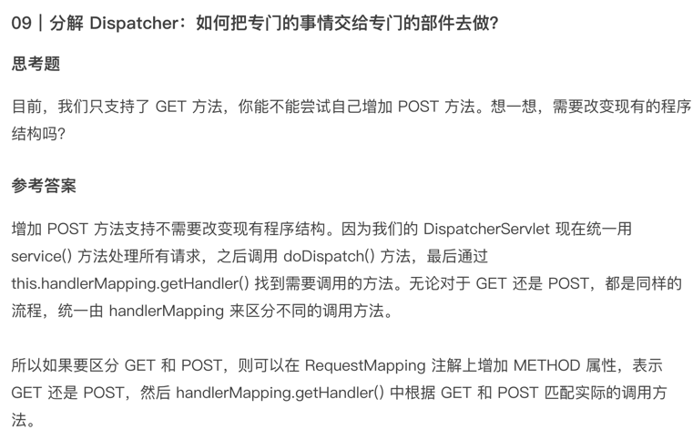

## ioc
### v0.1 到 v0.2 版本的说明
1. readxml方法从资源文件读取内容并存入beanDefinitions，这件事情有两个地方不确定，资源的来源不同、资源的格式不同，抽象的Resource的接口，它的不同子类从不同的来源读取， 但是最终都是以Resource接口的形式提供给外部访问的，这样解决了第一个不确定来源的问题； 但是resource接口中被迭代的object又是根据不同格式不同而不同的， element只是xml格式的，所以又定义了BeanDefinitionReader接口， 它的不同子类可以读取不同格式的资源来形成beanDefinition 。
2. instanceBeans方法取消了 。
3. getBean方法功能增强了，不仅是获得bean，对于未创建的bean还要创建bean
4. 新的applicationContext负责组装，可以根据它的名字来体现它的组装功能，例如ClassPathXmlApplicationContext  它组装的Resource的实现类是ClassPathXmlResource  ，然后因为是xml的，所以需要BeanDefinitionReader的实现类XmlBeanDefinitionReader来读取并注册进beanFactory，同时ApplicationContext也提供了getBean底层调用beanfactory的实现，提供了registerBeanDefinition  来向底层的beanFactory注册bean。5 beanFactory 提供了registerBeanDefinition和getBean接口，这样无论是applicationContext还是beanDefinitionReader都可以向它注册beanDefinition，只要向它注册了，就可以调用它的getBean方法，我一直很纠结为什么不是beanfactory调用不同的beanDefinitionReader，写完这些，好像有点理解了，这样beanfactory就很专注自己的getBean方法，别的组件要怎么注入，它都不管了。

### v0.2 到 v0.3 版本的说明
1、增加单例 Bean 的接口定义，然后把所有的 Bean 默认为单例模式。
2、预留事件监听的接口，方便后续进一步解耦代码逻辑。
3、扩展 BeanDefinition，添加一些属性，现在它只有 id 和 class 两个属性

### v0.3 到 v0.4 版本的说明
1、Spring 如何解析<property>和<constructor-arg>标签。、
2、构造器注入
3、setter注入
4、Bean 之间的依赖注入
5、解决循环依赖

### v0.4 到 v0.5 版本的说明
通过 Autowired 这个注解实现了 Bean 的注入，这样程序员不用再在 XML 配置文件中手动配置 property，而是在类中声明 property 的时候直接加上注解即可，框架使用的机制是名称匹配，这也是 Spring 所支持的一种匹配方式。

接着我们提取了 BeanFactory 接口，定义了一个抽象的 AbstractBeanFactory。通过这个抽象类，将 Bean 工厂需要做的事情的框架搭建出来，然后在具体实现类中完善细节。这种程序结构称为 interface-abstract class-class（接口抽象类），是一种做框架时常用的设计模式。

### v0.5 到 v0.6 版本的说明
0、【接口】BF，Bean工厂
1、【接口】SingletonBeanRegistry，单例Bean仓库
2、DefaultSingletonBeanRegistry，单例Bean仓库默认实现。提供了 1 注册列表 2 单例容器 3 依赖注入管理信息（两个Map，应该是依赖 & 被依赖）
3、【接口】BeanDefinitionRegistry【接口】ListableBF，这两个对照看差异。前者强调对BeanDefinition进行操作，后者强调是对List集合进行操作。
4、【接口】ConfigurableBF，Bean处理器（add & get，没有apply），以及管理依赖信息。
5、【接口】AutowireCapableBF，提供自动装配选项（No、byName、byType），并在初始化前后应用（apply）Bean处理器。
6、【集成接口】ConfigurableListableBF，无内容。
7、【抽象类】AbstractBF，主要是refresh()，invokeInitMethod()，createBean()，构造器注入和属性注入。
8、AbstractAutowireCapableBF，提供成员List<BeanPostProcessor>！也因此它可以通过该成员进行更多的bean处理器操作，即add、get、apply在此有了具体实现。
9、DefaultListableBF，其实没有啥，打开一看只Override了【接口】ListableBF中的4个方法，其余是默认继承。（即沿着类结构往上一堆，上面也说过了）

完善ApplicationContext
- 抽取 ApplicationContext 接口，实现更多有关上下文的内容。
- 支持事件的发布与监听。
- 新增 AbstractApplicationContext，规范刷新上下文 refresh 方法的步骤规范，且将每一步骤进行抽象，提供默认实现类，同时支持自定义。
- 完成刷新之后发布事件

## Spring MVC
### mvc 0.1
+ DispatcherServlet，它是 Tomcat 中注册的唯一的 Servlet，它承担了所有请求的处理功能。由它来解析请求中的路径与业务类 Bean 中方法的映射关系，调用 Bean 的相应方法，返回给 response。
+ 这种映射关系的建立，我们一开始是让用户自己在 XML 配置文件中手动声明，然后我们引入 RequestMapping 注解，扫描包中的类，检查注解，自动注册映射关系。 
+ 这样我们初步实现了比较原始的 MVC。在这个框架下，应用程序员不用再关心 Servlet 的使用，他们可以直接建立业务类，加上注解就可以运行。

  
### mvc 0.2
当 Servlet 服务器如 Tomcat 启动的时候，要遵守下面的时序。
1. 在启动 Web 项目时，Tomcat 会读取 web.xml 中的 comtext-param 节点，获取这个 Web 应用的全局参数。
2. Tomcat 创建一个 ServletContext 实例，是全局有效的。
3. 将 context-param 的参数转换为键值对，存储在 ServletContext 里。
4. 创建 listener 中定义的监听类的实例，按照规定 Listener 要继承自 ServletContextListener。监听器初始化方法是 contextInitialized(ServletContextEvent event)。初始化方法中可以通过 event.getServletContext().getInitParameter(“name”) 方法获得上下文环境中的键值对。
5. 当 Tomcat 完成启动，也就是 contextInitialized 方法完成后，再对 Filter 过滤器进行初始化。
6. servlet 初始化：有一个参数 load-on-startup，它为正数的值越小优先级越高，会自动启动，如果为负数或未指定这个参数，会在 servlet 被调用时再进行初始化。init-param 是一个 servlet 整个范围之内有效的参数，在 servlet 类的 init() 方法中通过 this.getInitParameter(″param1″) 方法获得。

+ 在 Tomcat 启动的过程中先拿 context-param，初始化 Listener，在初始化过程中，创建 IoC 容器构建 WAC（WebApplicationContext），加载所管理的 Bean 对象，并把 WAC 关联到 servlet context 里。 
+ 然后在 DispatcherServlet 初始化的时候，从 sevletContext 里获取属性拿到 WAC，放到 servlet 的属性中，然后拿到 Servlet 的配置路径参数，之后再扫描路径下的包，调用 refresh() 方法加载 Bean，最后配置 url mapping。
+ 我们之所以有办法整合这二者，核心的原因是 Servlet 规范中规定的时序，从 listerner 到 filter 再到 servlet，每一个环节都预留了接口让我们有机会干预，写入我们需要的代码。
+ 我们在学习过程中，更重要的是要学习如何构建可扩展体系的思路，在我们自己的软件开发过程中，记住不要将程序流程固定死，那样没有任何扩展的余地，而应该想着预留出一些接口理清时序，让别人在关节处也可以插入自己的逻辑。

### mvc 0.3
拆解 Dispatcher。
1. 首先拆解的是 ApplicationContext，现在我们有了两级上下文，一级用于 IoC 容器，我们叫 parent 上下文，一级用于 Web 上下文，WebApplicationContext 持有对 parent 上下文的引用。
2. 方便起见，我们还增加了 @RequestMapping 注解来声明 URL 映射，然后新增 RequestMappingHandlerMapping 与 RequestMappingHandlerAdapter，分别包装 URL 映射关系和映射后的处理过程。

MVC 里前后端参数的自动转换
1. 为了完成传入参数的自动绑定，我们使用了 WebDataBinder，它内部用 BeanWrapperImpl 对象，把属性值的 map 绑定到目标对象上。绑定的过程中，要对每一种数据类型分别进行格式转换，对基本的标准数据类型，由框架给定默认的转换器，但是对于别的数据类型或者是文化差异很大的数据类型，如日期型，我们可以通过 CustomEditor 机制让用户自定义。
2. 通过数据的自动绑定，我们不用再通过 request.getParameter() 方法手动获取参数值，再手动转成对象了，这些 HTTP 请求里的参数值就自动变成了后端方法里的参数对象值，非常便利。实际上后面我们会看到，这种两层之间的数据自动绑定和转换，在许多场景中都非常有用，比如 Jdbc Template。

### mvc 0.4
1. 我们重点探讨了 MVC 调用目标方法之后的处理过程，如何自动转换数据、如何找到指定的 View、如何去渲染页面。
2. 我们可以看到，作为一个框架，我们没有规定数据要如何转换格式，而是交给了 MessageConverter 去做；
3. 我们也没有规定如何找到这些目标页面，而是交给了 ViewResolver 去做；
4. 我们同样没有规定如何去渲染前端界面，而是通过 View 这个接口去做。我们可以自由地实现具体的场景。

### mvc 总结
1. MVC 重点回顾
MVC 是 Spring 框架的核心组成部分之一，负责实现一个 Web 应用程序的模型视图控制器模式。Spring 框架提供了丰富的组件和工具，而 MVC 负责处理一个 Web 应用程序中的核心过程，例如请求处理、数据转换、模板渲染和视图管理等。而 MVC 和 Spring 的结合，就像是车与引擎的结合一样，给 Web 应用程序提供了强大而且可靠的性能和灵活性，让我们能够快速、方便地搭建高性能、可靠的 Web 应用程序。
因为 Spring 是 Java 实现的，也因为发明人 Rod Johnson 先生自己是 Java 团队 Servlet 规范的专家组成员，所以很自然，他的 MVC 的实现是基于 Servlet 的。利用 Servlet 的机制，把这种功效发挥到了极致，快速构造了完整的 Web 程序结构，让我们大开眼界。

2. 那我们在课程中是怎么实现 MVC 的呢？
首先我们利用 Servlet 机制，用一个单一的 Servlet 拦截所有请求，由它来分派任务，这样实现了原始的 MVC 结构。然后呢，我们把 MVC 和 IoC 结合在一起，在 Servlet 容器启动的时候，给上下文环境里注入 IoC 容器，使得在 Servlet 里可以访问到 IoC 容器里的 Bean。
之后我们进一步解耦 MVC 结构，独立出请求处理器，还用一个简洁统一的注解方式，把 Web 请求方便地定位到后台处理的类和方法里，实现 Spring 的 RequestHandler。
在前后台打通的时候，实现数据参数的自动转换，也就是说先把 Web 请求的传入参数，自动地从文本转换成对象，实现数据绑定功能。对于返回数据，也自动根据用户需求进行格式化转换，这样实现了 Spring 里面的 data binder 和 data conversion。

最后回到前端 View，如果有前端引擎，在 Spring 中引用，把数据自动渲染到前端。我们可以利用 Servlet 机制、MVC 结构、IoC 容器、RequestHandler 和数据绑定等功能，确保前后台的有效沟通和良好的交互体验，实现一个高效可靠的 Web 应用程序。你学会了吗？

3. 思考题

   

### jdbc 0.1 
1. 新增基础的jdbc
2. 修改@Autowired注解失败的bug