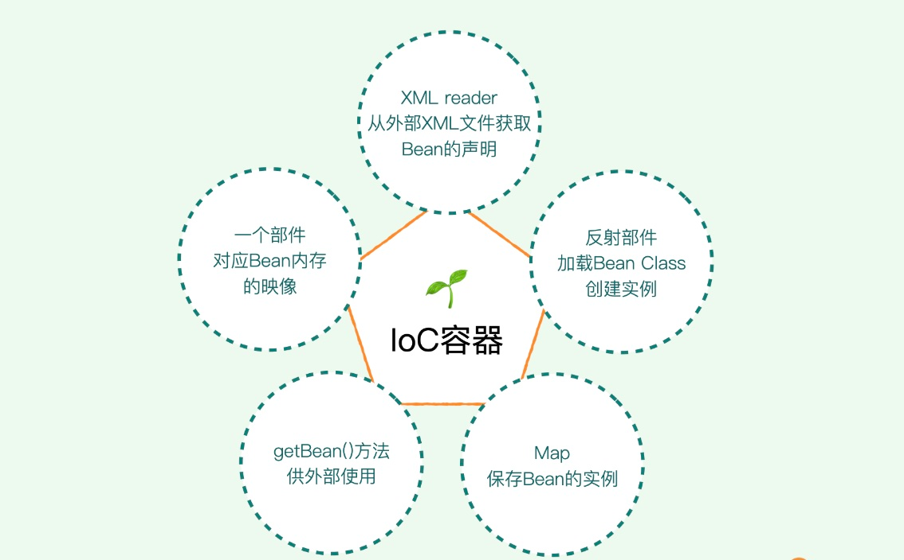
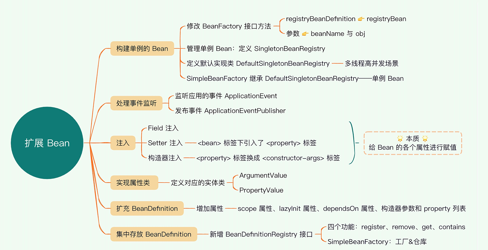
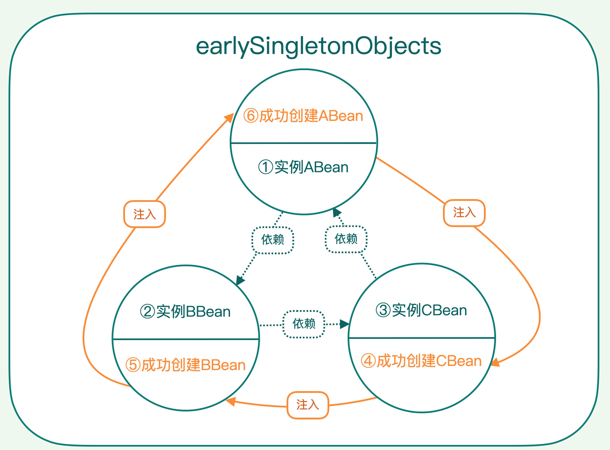
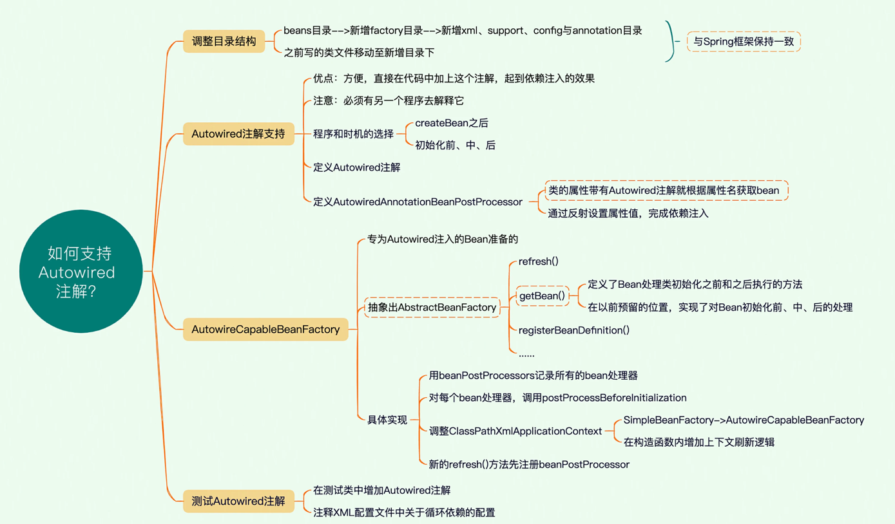
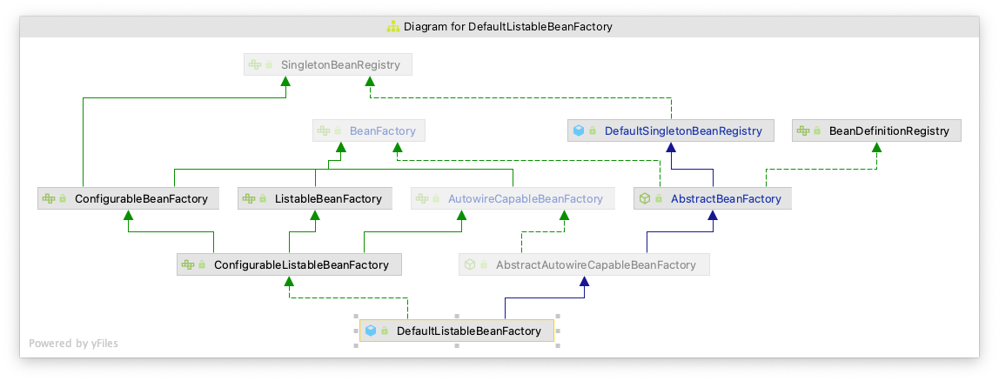

### v0.1 到 v0.2 版本的说明
1. readxml方法从资源文件读取内容并存入beanDefinitions，这件事情有两个地方不确定，资源的来源不同、资源的格式不同，抽象的Resource的接口，它的不同子类从不同的来源读取， 但是最终都是以Resource接口的形式提供给外部访问的，这样解决了第一个不确定来源的问题； 但是resource接口中被迭代的object又是根据不同格式不同而不同的， element只是xml格式的，所以又定义了BeanDefinitionReader接口， 它的不同子类可以读取不同格式的资源来形成beanDefinition 。
2. instanceBeans方法取消了 。
3. getBean方法功能增强了，不仅是获得bean，对于未创建的bean还要创建bean
4. 新的applicationContext负责组装，可以根据它的名字来体现它的组装功能，例如ClassPathXmlApplicationContext  它组装的Resource的实现类是ClassPathXmlResource  ，然后因为是xml的，所以需要BeanDefinitionReader的实现类XmlBeanDefinitionReader来读取并注册进beanFactory，同时ApplicationContext也提供了getBean底层调用beanfactory的实现，提供了registerBeanDefinition  来向底层的beanFactory注册bean。5 beanFactory 提供了registerBeanDefinition和getBean接口，这样无论是applicationContext还是beanDefinitionReader都可以向它注册beanDefinition，只要向它注册了，就可以调用它的getBean方法，我一直很纠结为什么不是beanfactory调用不同的beanDefinitionReader，写完这些，好像有点理解了，这样beanfactory就很专注自己的getBean方法，别的组件要怎么注入，它都不管了。

### v0.2 到 v0.3 版本的说明
1、增加单例 Bean 的接口定义，然后把所有的 Bean 默认为单例模式。
2、预留事件监听的接口，方便后续进一步解耦代码逻辑。
3、扩展 BeanDefinition，添加一些属性，现在它只有 id 和 class 两个属性

### v0.3 到 v0.4 版本的说明
1、Spring 如何解析<property>和<constructor-arg>标签。、
2、构造器注入
3、setter注入
4、Bean 之间的依赖注入
5、解决循环依赖

### v0.4 到 v0.5 版本的说明
通过 Autowired 这个注解实现了 Bean 的注入，这样程序员不用再在 XML 配置文件中手动配置 property，而是在类中声明 property 的时候直接加上注解即可，框架使用的机制是名称匹配，这也是 Spring 所支持的一种匹配方式。

接着我们提取了 BeanFactory 接口，定义了一个抽象的 AbstractBeanFactory。通过这个抽象类，将 Bean 工厂需要做的事情的框架搭建出来，然后在具体实现类中完善细节。这种程序结构称为 interface-abstract class-class（接口抽象类），是一种做框架时常用的设计模式。

### v0.5 到 v0.6 版本的说明
0、【接口】BF，Bean工厂
1、【接口】SingletonBeanRegistry，单例Bean仓库
2、DefaultSingletonBeanRegistry，单例Bean仓库默认实现。提供了 1 注册列表 2 单例容器 3 依赖注入管理信息（两个Map，应该是依赖 & 被依赖）
3、【接口】BeanDefinitionRegistry【接口】ListableBF，这两个对照看差异。前者强调对BeanDefinition进行操作，后者强调是对List集合进行操作。
4、【接口】ConfigurableBF，Bean处理器（add & get，没有apply），以及管理依赖信息。
5、【接口】AutowireCapableBF，提供自动装配选项（No、byName、byType），并在初始化前后应用（apply）Bean处理器。
6、【集成接口】ConfigurableListableBF，无内容。
7、【抽象类】AbstractBF，主要是refresh()，invokeInitMethod()，createBean()，构造器注入和属性注入。
8、AbstractAutowireCapableBF，提供成员List<BeanPostProcessor>！也因此它可以通过该成员进行更多的bean处理器操作，即add、get、apply在此有了具体实现。
9、DefaultListableBF，其实没有啥，打开一看只Override了【接口】ListableBF中的4个方法，其余是默认继承。（即沿着类结构往上一堆，上面也说过了）
